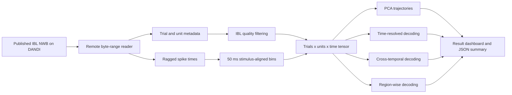

# Decision Geometry

**Real-data computational neuroscience with IBL Neuropixels recordings**

[](https://www.python.org/)
[](https://dandiarchive.org/dandiset/000409)
[](https://www.nwb.org/)
[](LICENSE)
[](https://decision-geometry-ibl.joseph-titus.chatgpt.site)

How do **sensory evidence**, an animal's **learned prior**, and its eventual
**choice** emerge in the activity of many neurons at once? Decision Geometry
turns a published International Brain Laboratory (IBL) recording into a compact,
reproducible population-dynamics analysis.

The pipeline streams real spike trains and behavior from DANDI, aligns neural
activity to each decision, and asks not only *whether* task information is
decodable, but also *when it appears*, *how stable its neural representation is*,
and *which recorded regions contain it*.

**[Launch the interactive Decision Geometry explorer](https://decision-geometry-ibl.joseph-titus.chatgpt.site)** to scrub through time and switch between information, code-stability, and regional views.

## Main result


This figure is generated by the repository from the pinned public NWB asset.
It is not a mockup or synthetic example.

### Reading the figure

**A. Choice-conditioned neural trajectories.** Each line is the average
population state for one wheel choice, projected onto the first two principal
components. The separation between trajectories shows that the activity of the
recorded population evolves differently for clockwise and counter-clockwise
decisions. Circles mark the start of the analysis window at `-0.5 s`; squares
mark its end at `+1.0 s`.

**B. Information over time.** Cross-validated logistic decoders estimate how
well a linear readout can recover stimulus side, block prior, or choice from one
50 ms population snapshot. Chance is `0.5`. Choice peaks at **82.8% balanced
accuracy around 275 ms after stimulus onset**, stimulus side reaches **79.3%**,
and block prior reaches **69.6%**.

**C. Cross-temporal choice decoding.** A decoder is trained at every time point
and tested at every other time point. The bright post-stimulus band shows that
choice information generalizes across nearby times, while its changing shape
shows that the neural code is not perfectly static.

**D. Regional decoding.** The same choice decoder is fit separately to regions
with at least five quality-filtered units. Posterior and lateral-posterior
thalamic populations show strong decision-related information, with additional
signals in cuneiform, trigeminal motor, and parabrachial nuclei. Region-level
scores should be compared cautiously because neuron counts differ.

## The scientific question

Decision-making is distributed across populations and brain regions. A single
neuron can correlate with a stimulus or movement, but cognition is more naturally
described as a trajectory through a high-dimensional population state. This
project asks four connected questions:

1. Do leftward and rightward choices occupy distinct neural trajectories?
2. When do stimulus, prior, and choice become linearly readable?
3. Is the choice representation stable across time or dynamically reformatted?
4. Which recorded anatomical regions carry the strongest choice information?

## The gap this project addresses

Large open neurophysiology archives are scientifically valuable but difficult to
turn into a clear, reproducible computational story. The source asset here is
about 916 MB, uses ragged spike-time arrays, and combines neural, behavioral, and
anatomical tables. Many introductory analyses stop at rasters or mean firing-rate
plots; same-time decoding alone also cannot reveal whether the underlying code
is stable or changing.

Decision Geometry bridges that gap by providing:

- **Practical access:** HTTP byte-range streaming reads only the required NWB
  slices instead of downloading the whole recording.
- **Reproducible preprocessing:** explicit IBL unit-quality thresholds and a
  cached trial-by-unit-by-time tensor.
- **Population-level interpretation:** PCA trajectories connect individual
  spikes to low-dimensional neural dynamics.
- **Temporal tests:** time-resolved and cross-temporal decoding distinguish
  information strength from representational stability.
- **Anatomical comparison:** the same analysis is repeated across recorded
  regions using one consistent evaluation procedure.

This is the useful middle ground between a basic dataset-loading tutorial and a
full consortium-scale reanalysis.

## Data source

The analysis uses [DANDI:000409, IBL Brain Wide Map](https://dandiarchive.org/dandiset/000409),
a public collection of Neuropixels electrophysiology and behavioral data from
mice performing a visual decision task. The broader release contains recordings
from many laboratories and brain areas; this repository intentionally pins one
session so the demonstration remains reproducible and computationally practical.

| Field | Pinned value |
|---|---|
| Dandiset | `000409` |
| Published version | `0.260309.1324` |
| Asset ID | `882e2ff6-1fde-4518-8797-5d5892379739` |
| Subject | `NYU-39` |
| Session | `6ed57216-498d-48a6-b48b-a243a34710ea` |
| NWB asset | `sub-NYU-39_ses-6ed57216-498d-48a6-b48b-a243a34710ea_desc-processed_behavior+ecephys.nwb` |
| Source size | approximately 916 MB |
| Source license | CC BY 4.0 |

The NWB file provides:

- Spike times and quality metrics for `1,366` sorted units.
- `541` behavioral trials with stimulus side and contrast.
- Wheel choice, movement onset, feedback, and reward outcome.
- Blockwise prior probability for left and right stimuli.
- Electrode coordinates and anatomical region labels.

After strict quality filtering, the default analysis retains **93 units across
12 regions**. The strongest unit coverage in this session is in posterior and
lateral-posterior thalamus, so this is a focused sample from a brain-wide
collection, not complete whole-brain coverage in one animal.

## How it works



### 1. Stream and validate the NWB file

`decision_geometry/data.py` resolves the pinned DANDI asset, opens it through
`remfile` and `h5py`, and reads the standard NWB trials, units, and electrodes
tables. Only requested byte ranges are transferred.

### 2. Select reliable units

Units must satisfy all of the following:

- `ibl_quality_score == 1.0`
- `presence_ratio >= 0.9`
- firing rate between `0.1` and `100 Hz`
- a valid maximum-amplitude electrode with an anatomical label

### 3. Construct population activity

For every valid choice trial, spikes are aligned to visual stimulus onset and
binned from `-0.5 s` to `+1.0 s` in `50 ms` bins. This produces a tensor with
shape `trials x units x time`. The derived tensor is cached locally; raw data is
never committed to Git.

### 4. Measure geometry and information

- **PCA** standardizes unit activity and estimates low-dimensional trajectories.
- **Time-resolved decoding** uses five-fold stratified cross-validation and
  balanced accuracy to decode stimulus side, prior, and choice independently.
- **Cross-temporal decoding** trains at one time bin and tests at all bins,
  producing a train-time by test-time stability matrix.
- **Regional decoding** repeats choice decoding for anatomical regions with at
  least five retained units.

All classifier scaling is learned inside each training fold. The logistic model
uses a fixed regularization setting and class balancing, keeping the comparison
consistent across time and regions.

## Reproduce the analysis

```powershell
git clone https://github.com/josephreggy23-coder/IBL-Brain-Wide-Map.git
cd IBL-Brain-Wide-Map
python -m venv .venv
.\.venv\Scripts\Activate.ps1
pip install -e ".[dev]"
decision-geometry
pytest
```

The first run creates `data/cache/session_population.npz`. Later runs reuse that
cache and write the dashboard plus `results/summary.json`.

Useful options:

```powershell
# Re-read the public NWB source and rebuild the cache
decision-geometry --force-stream

# Run a smaller population or change temporal resolution
decision-geometry --max-units 64 --bin-size 0.05

# Record a different deterministic cross-validation split in the summary
decision-geometry --seed 42
```

The JSON summary records the selected `random_seed`, `bin_size_s`, and
`max_units_requested`, making the data-derived metrics and analysis settings
explicit when results are compared.

## Results at a glance

| Measurement | Result |
|---|---:|
| Valid trials | 541 |
| Quality-filtered units | 93 |
| Anatomical regions represented | 12 |
| Peak choice balanced accuracy | 82.8% |
| Peak choice time | 275 ms after stimulus onset |
| Peak stimulus-side balanced accuracy | 79.3% |
| Peak block-prior balanced accuracy | 69.6% |

Exact machine-readable values are stored in
[`results/summary.json`](results/summary.json).

## Interpretation and limits

Above-chance decoding means that a linear model can read information from the
recorded population. It does **not** establish that a region causes the choice.
Likewise, PCA is a descriptive projection rather than a mechanistic model of the
circuit.

This repository analyzes one session to provide a transparent, runnable example.
A research claim about the full IBL population would require held-out sessions,
animals, and laboratories; uncertainty estimates or permutation tests; controls
for movement and reaction time; and region comparisons matched for unit count.
Those are natural extensions rather than conclusions claimed here.

## Repository structure

```text
decision_geometry/
  data.py        remote NWB access, quality filtering, spike binning, cache
  analysis.py    PCA, time-resolved and cross-temporal decoding
  plotting.py    four-panel scientific result figure
  pipeline.py    end-to-end orchestration and summary export
  cli.py         command-line interface
results/
  decision_geometry.png
  summary.json
tests/           deterministic tests for filtering, caching, and decoding
```

## References and attribution

- International Brain Laboratory. [A brain-wide map of neural activity during
  complex behaviour](https://www.nature.com/articles/s41586-025-09235-0).
  *Nature* 645, 177-191 (2025). DOI: `10.1038/s41586-025-09235-0`.
- [IBL 2025 Brain Wide Map data-release documentation](https://docs.internationalbrainlab.org/notebooks_external/2025_data_release_brainwidemap.html).
- [DANDI Archive Dandiset 000409](https://dandiarchive.org/dandiset/000409).
- [Neurodata Without Borders](https://www.nwb.org/).

Code in this repository is MIT licensed. The source data is CC BY 4.0; cite the
IBL publication and DANDI record when using it for research.
