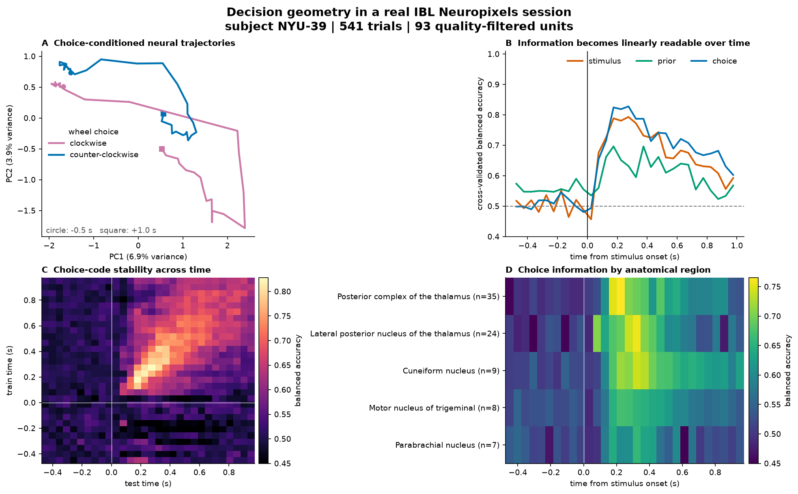

# Decision Geometry

Real-data computational neuroscience: how do stimulus evidence, learned prior,
and eventual choice unfold across a population of simultaneously recorded
neurons?

This repository streams a published International Brain Laboratory (IBL)
Neuropixels session from the DANDI Archive, extracts trial-aligned spike counts,
and measures the geometry and temporal stability of decision-related population
states. It uses no EEG and generates no synthetic data in the main pipeline.



## What the analysis does

- Streams byte ranges from a pinned, published NWB file instead of downloading
  the full 916 MB asset.
- Keeps units passing all IBL quality metrics, then bins spikes around visual
  stimulus onset.
- Projects trial activity into a low-dimensional neural state space with PCA.
- Decodes stimulus side, block prior, and wheel choice at each time bin using
  cross-validated logistic regression.
- Builds a cross-temporal generalization matrix to test whether the choice code
  is stable or rapidly changing.
- Compares the timing of choice information across recorded anatomical regions.

The sample session contains 541 trials and 1,366 sorted units before quality
filtering. Its strongest coverage is in posterior and lateral-posterior thalamus,
with additional midbrain and brainstem recordings.

## Run it

```powershell
python -m venv .venv
.\.venv\Scripts\Activate.ps1
pip install -e ".[dev]"
decision-geometry
pytest
```

The first run reads the needed slices remotely and stores a derived cache at
`data/cache/session_population.npz`. Later runs use that cache. Figures and a
machine-readable summary are written to `results/`.

Useful options:

```powershell
decision-geometry --force-stream
decision-geometry --max-units 64 --bin-size 0.05
```

## Data provenance

- DANDI Dandiset: [000409, IBL Brain Wide Map](https://dandiarchive.org/dandiset/000409)
- Pinned release: `0.260309.1324`
- Subject: `NYU-39`
- Session: `6ed57216-498d-48a6-b48b-a243a34710ea`
- Asset: `sub-NYU-39_ses-6ed57216-498d-48a6-b48b-a243a34710ea_desc-processed_behavior+ecephys.nwb`
- Dataset documentation: [IBL 2025 Brain Wide Map release](https://docs.internationalbrainlab.org/notebooks_external/2025_data_release_brainwidemap.html)
- Associated publication: [A brain-wide map of neural activity during complex behaviour](https://www.nature.com/articles/s41586-025-09235-0)

The IBL release includes Neuropixels recordings, sensory stimuli, choices,
response times, and pose estimates. DANDI distributes the data in Neurodata
Without Borders (NWB), so the loader is based on a standard rather than a
lab-specific file parser.

## Interpretation

Above-chance decoding means population activity contains linearly readable
information about a variable; it does not imply that the recorded region causes
the behavior. A broad cross-temporal diagonal suggests a stable code, while a
narrow diagonal suggests that the population representation changes over time.
This single-session analysis is a reproducible portfolio demonstration, not a
claim of across-animal generalization.

## Repository map

```text
decision_geometry/
  data.py        remote NWB access, quality filtering, spike binning, cache
  analysis.py    PCA, time-resolved and cross-temporal decoding
  plotting.py    publication-style four-panel result figure
  pipeline.py    end-to-end orchestration and summary export
  cli.py         command-line interface
tests/           deterministic unit tests with compact fixtures
```

Code in this repository is MIT licensed. The source dataset is CC BY 4.0 and
must be cited according to the DANDI/IBL record when used in research.
