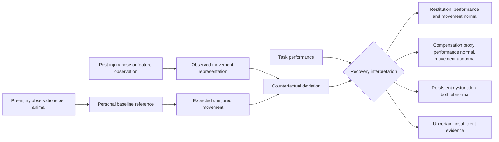
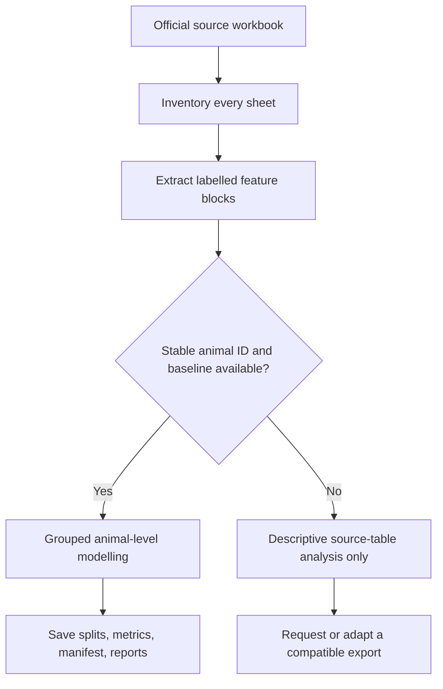

# CoRe-TBI

**Counterfactual Recovery Modeling after Traumatic Brain Injury**

CoRe-TBI is an open-source research framework for asking a question conventional behavioural scores cannot answer: did an animal return toward its own pre-injury movement strategy, or did it regain task performance using an abnormal strategy?

It is a methodological research prototype, not a diagnostic or clinical tool. The biological unit of inference is always the animal—not a frame, stride, or session count.

## Core idea

For each post-injury observation, the framework compares observed movement with a personalized reference learned from that animal’s pre-injury observations. It separates task performance from movement organization and reports uncertainty when tracking quality, observation count, or baseline coverage is inadequate.



`Compensation proxy` is deliberately operational: it does not prove a biological compensatory mechanism. It means task performance is within an empirical baseline/sham tolerance while multivariate movement remains outside tolerance.

## What is implemented

| Capability | Status |
| --- | --- |
| Synthetic longitudinal TBI demonstration cohort | Ready |
| Within-animal robust baseline and recovery-plane scoring | Ready |
| Restitution / compensation proxy / dysfunction / uncertainty states | Ready |
| GroupKFold and leave-one-animal-out utilities | Ready |
| Automatic animal-leakage checks | Ready |
| PCA-logistic and random-forest grouped baselines | Ready |
| DeepLabCut flattened and three-row-header parser | Ready |
| Official ALMA Figshare metadata, checksum-aware download, and source-table extraction | Ready |
| QC missingness and tracking-quality reports | Ready |
| Per-run provenance manifests | Ready |
| Pose encoder, PC-RSSM state-space layer, and external validation | Planned |

## Data strategy

The primary public anchor is the official ALMA Figshare source workbook: [Data used to create figures](https://doi.org/10.6084/m9.figshare.17212856.v1). Its workbook is organized as published figure/source-data tables. CoRe-TBI inventories and extracts those tables with source sheet, source block, and source-row provenance.

The source table currently available does not include stable animal identifiers. The framework therefore **blocks** animal-level counterfactual training on that extracted table rather than creating a misleading random stride split. The synthetic cohort remains the executable end-to-end demonstration until a per-animal ALMA export or another compatible public dataset is supplied.



## Quick start

```powershell
cd "C:\Users\Jose\Documents\Github reoi\core-tbi"
python -m venv .venv
.venv\Scripts\activate
pip install -e ".[dev]"

# Reproducible demonstration (clearly labelled synthetic)
core-tbi demo

# Official ALMA metadata and source-table preparation
core-tbi datasets official-inventory alma
core-tbi datasets download alma --file-id <FILE_ID>
core-tbi prepare --dataset alma
core-tbi qc
```

## Command-line workflow

```text
core-tbi datasets list
core-tbi datasets inspect alma
core-tbi datasets official-inventory alma
core-tbi datasets download alma --file-id <FILE_ID>
core-tbi prepare --dataset alma
core-tbi qc --input outputs/tables/synthetic_recovery_scores.csv
core-tbi train-feature --input data/processed/features.csv
core-tbi report --animal TBI_01
core-tbi demo
```

`train-feature` requires a feature table containing stable `animal_id`, `timepoint`, and `condition` values. It refuses to run when those requirements are not met.

## Reproducibility and scientific safeguards

- All observations from one animal remain in one partition.
- Empirical tolerances come from baseline repeatability and sham variability, not arbitrary thresholds.
- QC reports retain missingness and low-confidence observations; they do not silently exclude them.
- Analysis commands save source tables, split assignments, metrics, and run manifests where applicable.
- Synthetic outputs are explicitly labelled and must never be presented as experimental findings.
- Dataset identity, speed, session order, recording setup, and missingness are treated as potential confounds.

## Repository map

```text
configs/                 experiment and dataset registry YAML
data/raw/                immutable source files (ignored by Git)
data/processed/          user-provided ready-to-model tables
docs/                    rationale, validation plan, data dictionary, rat protocol
outputs/                 generated reports, metrics, figures, manifests
src/core_tbi/data/       data adapters, DLC parser, ALMA extractor
src/core_tbi/models/     transparent recovery model and baselines
src/core_tbi/evaluation/ grouped splits and leakage safeguards
tests/                   CPU-level regression tests
```

## Roadmap

1. Validate feature-mode modelling on a public dataset with individual animal IDs and repeated baseline sessions.
2. Add likelihood-aware pose windows, short-gap interpolation flags, and anatomical normalization.
3. Add temporal and graph pose encoders.
4. Add the paired counterfactual recovery state-space model (PC-RSSM).
5. Evaluate across TBI, stroke, and pharmacological slowing without collapsing their biological labels.
6. Add the prospective repetitive-mild-TBI rat metadata and synchronized LFP interface.

See [docs/scientific_rationale.md](docs/scientific_rationale.md), [docs/compensation_definition.md](docs/compensation_definition.md), and [docs/validation_plan.md](docs/validation_plan.md) for the intended scientific interpretation.
